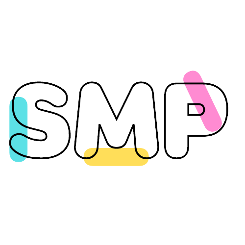
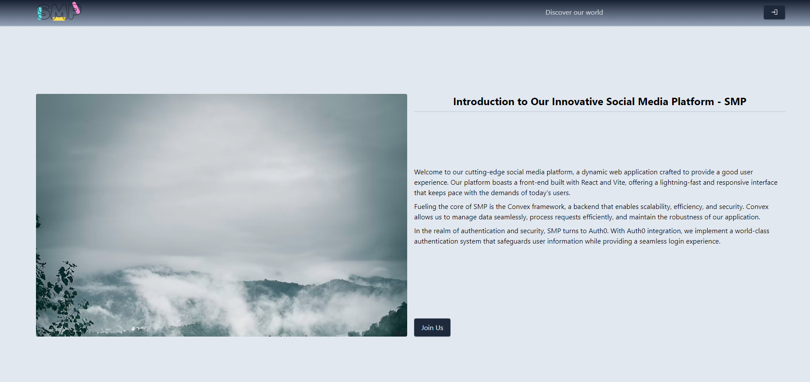
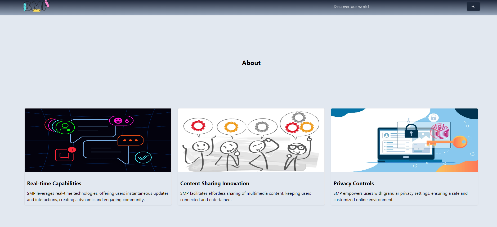
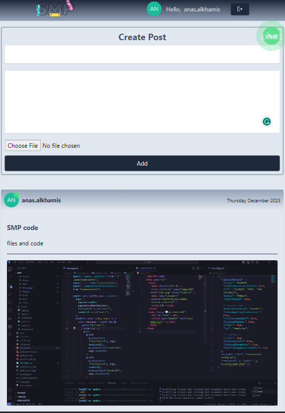
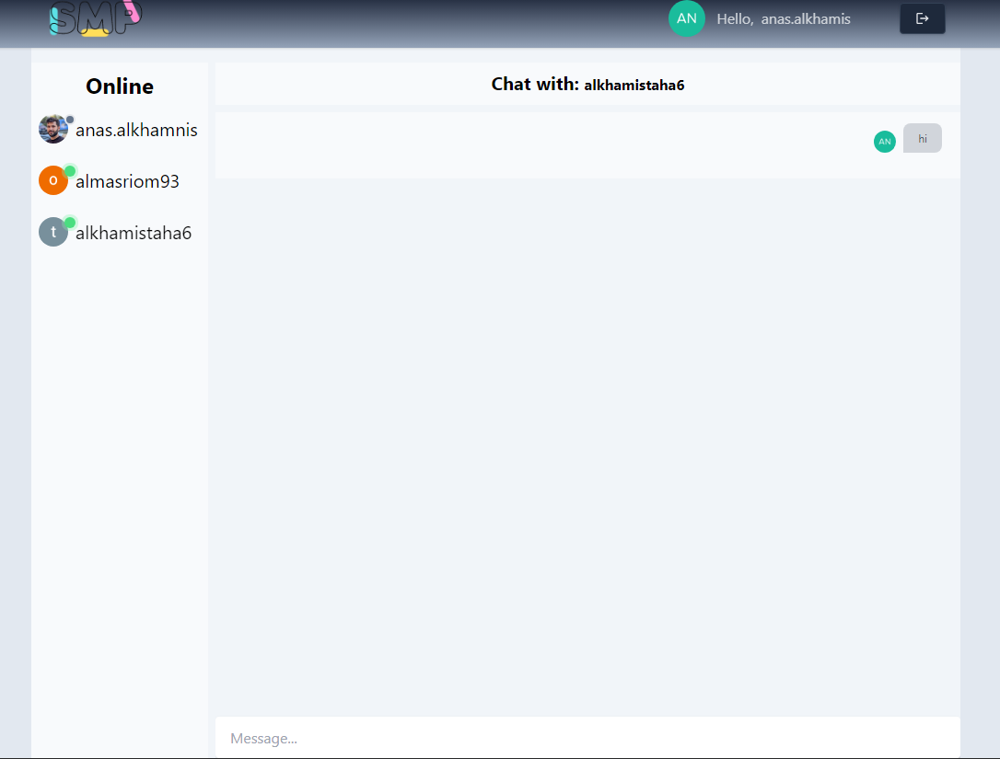

# SMP - Social Media Platform

## Project Description

SMP is a cutting-edge social media platform built with TypeScript and ReactJS on the frontend, utilizing Vite as the build tool. The project incorporates Formik & YUP for form management, React Router DOM for seamless navigation, and Auth0 for secure user authentication. On the backend, SMP relies on Convex to handle data processing and server-side functionalities.

## Screenshots

- main page hero section
  
- main page about section
  
- home page post form and posts sections
  
- messenger page active users and chat sections
  

## Technologies Used

- TypeScript
- Vite & ReactJS
- React Router DOM
- Formik & YUP
- Auth0 (for user authentication)
- Convex (backend framework)

## Getting Started

Follow these instructions to get a copy of the project up and - running on your local machine.

### Prerequisites

Node.js and npm installed on your machine.

### Installation

1. Clone the repository:

```bash
git clone https://github.com/A1-LearningTemplates/SMP.git
cd smp
```

2. Install dependencies:

```bash
npm install
```

### Configuration

1.  Set up Auth0 credentials:

    - Obtain Auth0 credentials and replace them in the configuration file.

2.  Configure Convex backend:

    - Set up your Convex backend and update the backend in the configuration file.

### Running the Application

Start the development server:

```bash
npx convex dev
npm run dev
```

Open your browser and visit http://localhost:5173 to view the application.

## Usage

### Login or Join Us:

1. Visit SMP Website: Open your web browser and go to the SMP website.
2. Join Us: On the main page, click on the "Join Us" button to initiate the registration process.
   If you already have an account, click on the "Login" button to access your account.

### Create a New Post:

1. Navigate to Home:
   - After logging in, you will be directed to the home page.
   - Click on the "Create Post" button to share your thoughts, photos.
2. Compose Your Post:

   - Write your message in the text area.
   - Optionally, attach photos.
   - Click "Post" to share your content with your connections.

### Start a New Chat:

1.  Access Messenger:

    - From the home page, locate and click on the "Chat" button.
    - This will navigate you to the Messenger page.

2.  Initiate a Chat:

    - Find a friend from your contacts.
    - Click on their profile to open the chat window.
    - Start typing your message to begin a conversation.

## Code Samples

### Using Formik and YUP for User Registration Form

This code snippet represents a simple registration form component using Formik and YUP for form management and validation.

```javascript
import { Formik, FormikHelpers, Form, Field, ErrorMessage } from "formik";
import * as Yup from "yup";
type FormInitialValues = {
  title: string,
  body: string,
};
// convex hook
import { useMutation } from "convex/react";
import { api } from "../../../convex/_generated/api";
import { Id } from "../../../convex/_generated/dataModel";

const AddPost = () => {
    // This function will create a new post, it takes the new post as a parameter ({object})
  const createPost = useMutation(api.posts.createPost);
// initial values for Formik component
  const initialValues = {
    title: "",
    body: "",
  };
  // using YUP to create validation schema
  const postSchema = Yup.object().shape({
    title: Yup.string()
      .min(2, "Too Short!")
      .max(50, "Too Long!")
      .required("Required"),
    body: Yup.string()
      .min(10, "Too Short!")
      .max(300, "Too Long!")
      .required("Required"),
  });
// This function will handle form submission
  const onSubmit = async (
    values: FormInitialValues,
    actions: FormikHelpers<FormInitialValues>
  ) => {
    try {
      const postData = {
        ...values,
      };
      const _id = await createPost(postData);
      actions.resetForm();
    } catch (error) {
      throw new Error("Something went wrong");
    }
  };
  // formik Error message
  const renderError = (message: string) => (
    <span className="h-full bg-red-400 px-8 py-1 rounded">{message}</span>
  );
  return (
      <Formik
        initialValues={initialValues}
        validationSchema={postSchema}
        onSubmit={onSubmit}
      >
        <Form className="flex flex-col gap-3">
          <div>
            <Field className="input mb-2" name="title" type="text" />
            <ErrorMessage name="title" render={renderError} />
          </div>
          <div>
            <Field
              className="input resize-none "
              as="textarea"
              name="body"
              rows={6}
            />
            <ErrorMessage name="body" render={renderError} />
          </div>

          <button className="btn bg-slate-800" type="submit">
            Add
          </button>
        </Form>
      </Formik>
    </div>
  );
};

export default AddPost;
```

## Credits

This project is developed and maintained by [Anas Al-khamis]. Contributions are welcome, and you can find the project repository on GitHub at [repository link](https://github.com/A1-LearningTemplates/SMP).

## License

This project is open-source and available. Feel free to use, modify, and distribute it as needed.
